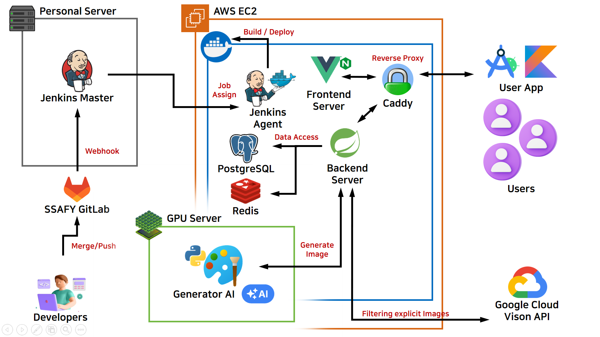

# 오픈티콘

### ✍🏻 프로젝트 설명:
오픈티콘은 사용자가 직접 제작한 이모티콘을 자유롭게 등록하고, 다양한 플랫폼에서 손쉽게 사용할 수 있도록 돕는 서비스입니다. 이모티콘 시장의 빠른 성장과 사용자들의 다양한 니즈를 반영하여, 누구나 쉽게 이모티콘 작가로 데뷔하고, 이모티콘을 다양한 용도로 활용할 수 있는 환경을 제공합니다.

### 개발기간 :
- 2024.10.14 ~ 2024.11.19(6주)

### 개발환경 : 
- 배포 환경 : EC2 ubuntu(20.04.6)
- GPU 서버 : Ubuntu(20.04), Python3.10

### 기술스택 :
- 백엔드 :       
- 프론트엔드 :  
- DevOps :   
- tool :    

### 아키텍쳐 : 

### 주요기능
1. **이모티콘 업로드**
   - 사용자가 직접 이모티콘 팩을 업로드 (무료 또는 유료).

2. **이모티콘 구매 및 다운로드**
   - 사용자는 원하는 이모티콘 팩을 구매 및 다운로드.

3. **플로팅 버튼을 통한 간편 사용**
   - 다양한 환경에서 플로팅 UI를 통해 이모티콘을 쉽고 빠르게 사용.
   - **안드로이드 앱**에서 다크모드 지원.

4. **AI 기반 이모티콘 제작**
   - Stable Diffusion 모델을 활용해 태그(성별, 머리색, 표정 등) 기반으로 이모티콘 생성하고 이모티콘 팩을 업로드.

5. **Google SafeSearch 기반 이모티콘 검수**
   - SafeSearch로 이모티콘 팩의 유해성 콘텐츠를 필터링.

6. **일반 검색**
   - 제목, 작가, 태그로 검색 및 최신순, 인기순으로 정렬.

7. **이미지 검색 기능**
   - 유사 이미지 검색(JImageHash)을 통해 이모티콘을 가지고 있는 이모티콘 팩을 검색 결과로 제공.

8. **결제 및 포인트 충전**
   - 포인트 충전 및 결제를 통해 이모티콘 구매 가능.

### 팀원소개 : 

|                      이름                      |      역할       | 
| :--------------------------------------------: | :-------------: |
|   박찬수 |  팀장, 인프라, 프론트(Web)    |
|   강도원 |  백엔드     |
|   김용원 |  프론트(Android), 백엔드  | 
|   김종원 |  백엔드     | 
|   박병준 |  프론트(Android), AI   |
|   양종원 |  프론트(Android)       |

